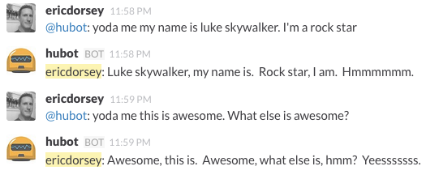

#### Usage

* Go to [https://www.mashape.com/ismaelc/yoda-speak#](https://www.mashape.com/ismaelc/yoda-speak#)
* Get an ```x-mashape-key```
* In ```yoda.coffee```, put that key in the ```.headers()``` ```x-mashape-key``` value.
* Put yoda.coffee in your ```hubot/scripts```
* Usage in chat: ```@hubot: yoda me {some text here}```


#### Example output
